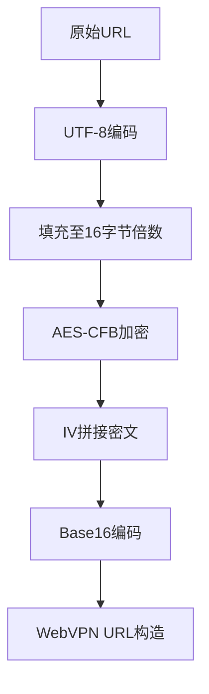
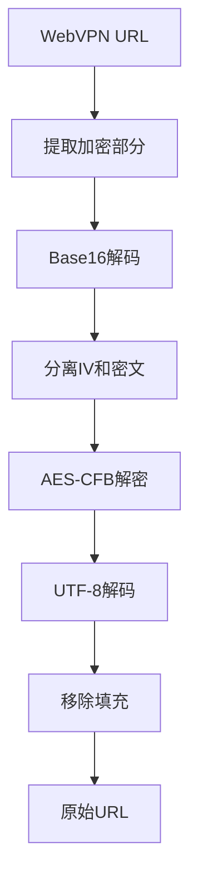

# Wengine-VPN URL 解密工具

一个专门用于解密东北大学等高校使用的 Wengine-VPN 系统加密 URL 的 Python 工具。本工具通过逆向分析 JavaScript 源代码，实现了对 WebVPN 加密 URL 的准确解密。

## 📋 目录

- [项目背景](#-项目背景)
- [技术分析](#-技术分析)
- [逆向分析过程](#-逆向分析过程)
- [安装步骤](#-安装步骤)
- [使用方法](#-使用方法)
- [加解密原理](#-加解密原理)
- [免责声明](#-免责声明)
- [许可证](#-许可证)

## 🎯 项目背景

东北大学（NEU）使用的 Wengine-VPN 系统是一种资源访问控制系统，它通过加密技术保护内网资源的访问URL。该系统将原始URL加密为一长串十六进制字符串，格式如下：

```
https://webvpn.neu.edu.cn/https/62304135386136393339346365373340a0e4b62c85cb47d1bc166e66c800d19283ef83/portal
```

本工具通过深入分析 Wengine-VPN 的前端 JavaScript 代码，成功破解了其加密机制，实现了URL的加解密功能。

## 🔍 技术分析

### 逆向分析过程

#### 1. JavaScript 源代码分析

通过分析东北大学 WebVPN 系统的前端 JavaScript 文件（`f54eeda.js` 和 `36edf52.js`），发现了加密核心逻辑：

**关键文件**: `36edf52.js` 中的加密函数：
```javascript
v = function(text, e, t) {
    var r = text.length;
    text = f(text, "utf8");
    var n = o.toBytes(e),        // 密钥转换为字节
        c = o.toBytes(t),        // IV转换为字节
        v = o.toBytes(text),     // 明文转换为字节
        m = new l(n, c, 16).encrypt(v);  // AES-CFB加密
    return d.fromBytes(c) + d.fromBytes(m).slice(0, 2 * r)
}
```

#### 2. 密钥和IV的发现

在分析过程中，指导用户通过以下方式找到加密参数：

1. **浏览器开发者工具**：在登录后的页面中检查Vue组件的状态数据
2. **网络请求分析**：观察登录过程中的API响应数据
3. **源代码搜索**：在JS文件中搜索 `wrdvpnKey` 和 `wrdvpnIV` 关键字

最终在系统状态中找到了关键的加密参数：
```javascript
"wrdvpnIV": "b0A58a69394ce73@",
"wrdvpnKey": "b0A58a69394ce73@"
```


#### 3. 加密算法确认

通过分析 `f54eeda.js` 文件，确认使用了 `aes-js` 库的CFB模式：
```javascript
var l = c.a.ModeOfOperation.cfb;
// 使用AES-CFB模式，segment_size为16（CFB8模式）
```

## 🛠️ 安装步骤

### 前提条件

- Python 3.6+
- pip 包管理工具

# 安装加密切依赖
pip install pycryptodome
```

## 🚀 使用方法

```bash
python wengine_decryptor.py
```

### 示例：解密东北大学WebVPN URL

```bash
============================================================
Wengine-VPN URL 解密工具 - 专为东北大学WebVPN设计
============================================================
使用密钥: b0A58a69394ce73@
使用IV: b0A58a69394ce73@
------------------------------------------------------------

请输入WebVPN URL（输入 'quit' 退出）: https://webvpn.neu.edu.cn/https/62304135386136393339346365373340a0e4b62c85cb47d1bc166e66c800d19283ef83/portal

提取的加密部分: 62304135386136393339346365373340a0e4b62c85cb47d1bc166e66c800d19283ef83
加密部分长度: 80 字符

============================================================
✅ 解密成功！
============================================================
原始WebVPN URL: https://webvpn.neu.edu.cn/https/62304135386136393339346365373340a0e4b62c85cb47d1bc166e66c800d19283ef83/portal
解密后的URL: http://portal.neu.edu.cn/
协议: http
域名: portal.neu.edu.cn
路径: /
```

## 🔐 加解密原理

### 加密流程



### 解密流程



### 技术细节

#### 1. 加密参数
- **算法**: AES-256-CFB
- **密钥**: `b0A58a69394ce73@` (32字节)
- **IV**: `b0A58a69394ce73@` (16字节)
- **模式**: CFB with segment_size=128 (CFB8)
- **填充**: 零填充(Zero Padding)

#### 2. URL结构解析
东北大学WebVPN URL格式：
```
https://webvpn.neu.edu.cn/[协议]/[加密字符串]/[可选路径]
```

其中协议可以是：
- `http`、`https`：网页访问
- `http-8080`、`https-8443`：带端口的网页服务
- `ssh`、`rdp`、`vnc`、`telnet`：远程连接服务

#### 3. 核心代码实现

```python
def decrypt_wengine_url(encrypted_hex, key, iv):
    """
    解密Wengine-VPN加密URL
    
    基于对东北大学WebVPN系统JS代码的逆向分析：
    - 文件: 36edf52.js 中的 v() 函数
    - 算法: AES-CFB with segment_size=128
    - 密钥/IV: b0A58a69394ce73@
    """
    # 转换为字节（与JS的o.toBytes()等效）
    key_bytes = key.encode('utf-8')
    iv_bytes = iv.encode('utf-8')
    
    # 分离IV和密文（前32字符为IV的十六进制）
    iv_hex = encrypted_hex[:32]
    ciphertext_hex = encrypted_hex[32:]
    
    # Base16解码
    ciphertext_bytes = bytes.fromhex(ciphertext_hex)
    
    # AES-CFB解密（与JS的new l(n, c, 16).encrypt(v)对应）
    cipher = AES.new(key_bytes, AES.MODE_CFB, iv=iv_bytes, segment_size=128)
    decrypted_data = cipher.decrypt(ciphertext_bytes)
    
    # 移除零填充并解码
    return decrypted_data.decode('utf-8').rstrip('\x00')
```

## ⚠️ 免责声明

**重要提示**：

1. **仅限教育研究**：本工具仅用于密码学学习和技术研究目的
2. **合法授权**：请在拥有合法访问权限的系统上使用
3. **尊重隐私**：不得用于解密未授权的URL或侵犯他人隐私
4. **遵守校规**：使用本工具应遵守东北大学的相关规定和政策
5. **责任自负**：使用者对使用本工具产生的后果自行负责

本工具是通过分析公开的前端JavaScript代码实现的加解密功能，旨在帮助理解WebVPN系统的工作原理。

## 📄 许可证

本项目采用 MIT 许可证 - 详见 [LICENSE](LICENSE) 文件。

## 🙏 致谢

感谢东北大学网络中心提供的WebVPN服务，使得我们有机会学习和研究现代Web加密技术的实现。

---

**注意**: 本工具仅用于教育和技术研究目的。请合法合规使用，尊重网络安全和隐私保护。
